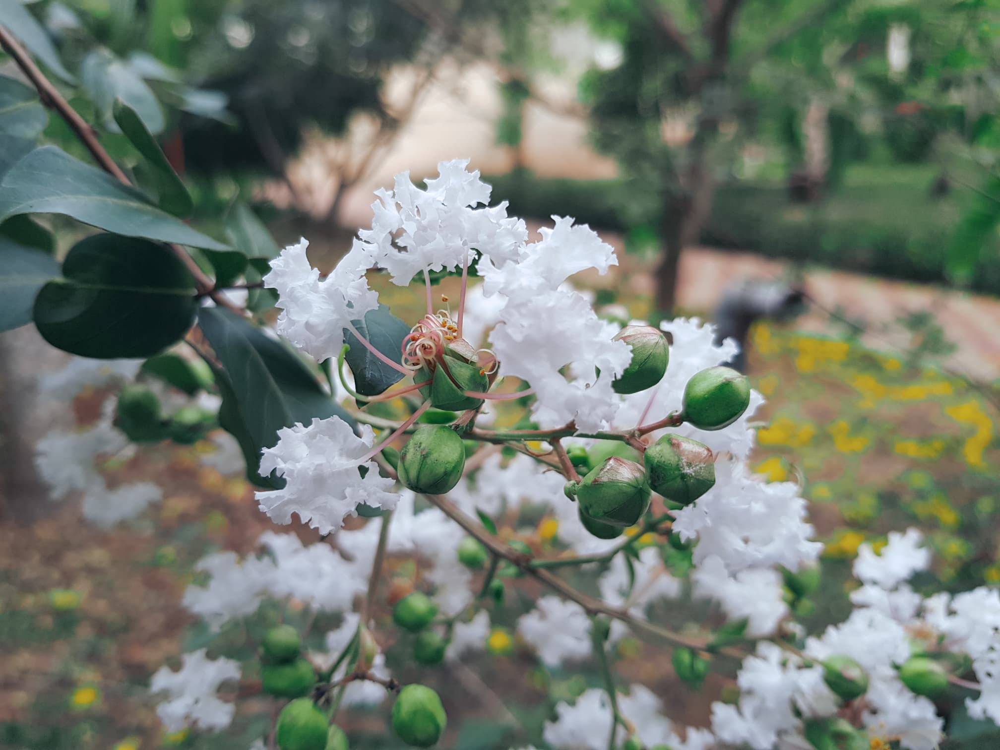
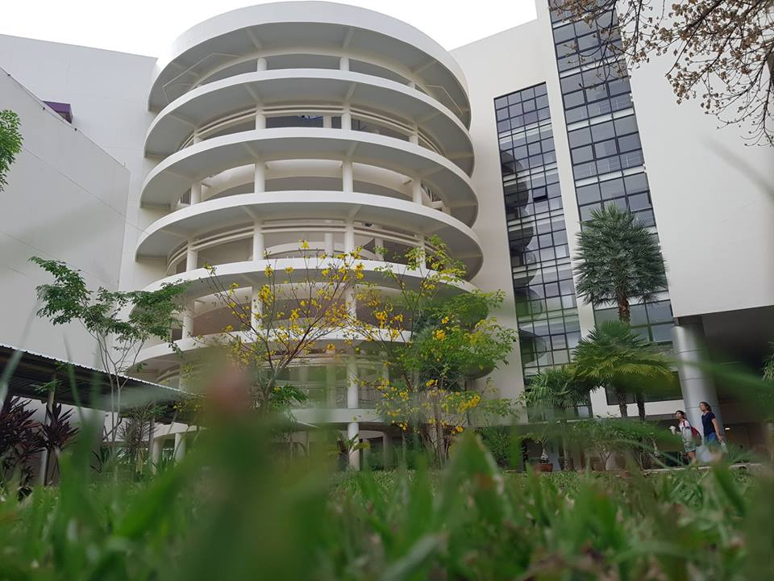
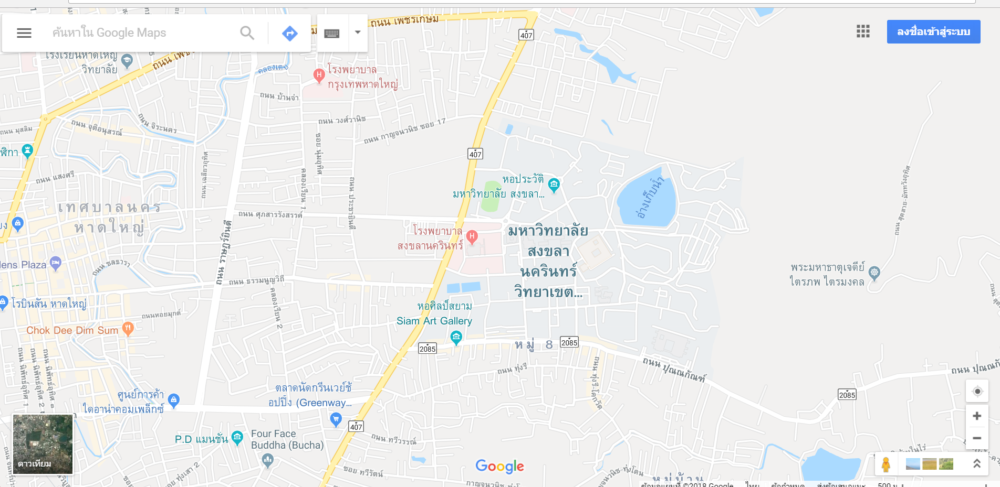

# diaryme
<!DOCTYPE html>
<html>
<title>DIARY ME</title>
<meta charset="UTF-8">
<meta name="viewport" content="width=device-width, initial-scale=1">
<link rel="stylesheet" href="https://www.w3schools.com/w3css/4/w3.css">
<link rel="stylesheet" href="https://fonts.googleapis.com/css?family=Raleway">
<link rel="stylesheet" href="https://cdnjs.cloudflare.com/ajax/libs/font-awesome/4.7.0/css/font-awesome.min.css">

<body>
<!-- Navbar (sit on top) -->

  

    
    <!-- Right-sided navbar links -->
    

      <a href="#about" class="w3-bar-item w3-button">HOME</a>
      <a href="#team" class="w3-bar-item w3-button"><i class="fa fa-user"></i> DIARY ME</a>
      <a href="#work" class="w3-bar-item w3-button"><i class="fa fa-th"></i> GALLERY</a>
      <a href="#contact" class="w3-bar-item w3-button"><i class="fa fa-envelope"></i> CONTACT</a>
    

    <!-- Hide right-floated links on small screens and replace them with a menu icon -->

    <a href="javascript:void(0)" class="w3-bar-item w3-button w3-right w3-hide-large w3-hide-medium" onclick="w3_open()">
      <i class="fa fa-bars"></i>
    </a>
  

<!-- Sidebar on small screens when clicking the menu icon -->
<nav class="w3-sidebar w3-bar-block w3-black w3-card w3-animate-left w3-hide-medium w3-hide-large" style="display:none" id="mySidebar">
  <a href="javascript:void(0)" onclick="w3_close()" class="w3-bar-item w3-button w3-large w3-padding-16">Close ×</a>
  <a href="#about" onclick="w3_close()" class="w3-bar-item w3-button">HOME</a>
  <a href="#team" onclick="w3_close()" class="w3-bar-item w3-button">DIARY ME</a>
  <a href="#work" onclick="w3_close()" class="w3-bar-item w3-button">GALLERY</a>
  <a href="#contact" onclick="w3_close()" class="w3-bar-item w3-button">CONTACT</a>
</nav>

</header>
<!-- HOME Section -->

    <h3 class="w3-center">HOME</h3>

<!-- DIARY ME Section -->

  <h3 class="w3-center">DIARY ME</h3>

<!-- GALLERY Section -->

  <h3 class="w3-center">GALLERY</h3>
  <!-- photo -->
     

   

     
     
     
   

   

     
     
     
   

   

     
     
     
   

 

<!-- Modal for full size images on click-->

  ×
  

    
    

  

<!-- Skills Section -->

  

    

      <h3>Our Skills.</h3>
      
Lorem ipsum dolor sit amet, consectetur adipiscing elit, sed do eiusmod 
      tempor incididunt ut labore et dolore.

      
Lorem ipsum dolor sit amet, consectetur adipiscing elit, sed do eiusmod 
      tempor incididunt ut labore et dolore.

    

<!-- Contact Section -->

  <h3 class="w3-center">CONTACT</h3>
  
Lets get in touch. Send us a message:

  

    

      
<i class="fa fa-map-marker fa-fw w3-xxlarge w3-margin-right"></i> Songkla, thailand

      
<i class="fa fa-phone fa-fw w3-xxlarge w3-margin-right"></i> Phone: 0847462470

      
<i class="fa fa-envelope fa-fw w3-xxlarge w3-margin-right"> </i> Email: bankpanjr12@gmail.com

       
      <form action="/action_page.php" target="_blank">
        
<input class="w3-input w3-border" type="text" placeholder="Name" required name="Name">

        
<input class="w3-input w3-border" type="text" placeholder="Email" required name="Email">

        
<input class="w3-input w3-border" type="text" placeholder="Subject" required name="Subject">

        
<input class="w3-input w3-border" type="text" placeholder="Message" required name="Message">

        

          <button class="w3-button w3-black" type="submit">
            <i class="fa fa-paper-plane"></i> SEND MESSAGE
          </button>
        

      </form>
    

    

      <!-- Add Google Maps -->
      

      
    

    

  

<!-- Footer -->
<footer class="w3-center w3-black w3-padding-64">
  

    <i class="fa fa-facebook-official w3-hover-opacity"></i>
    <i class="fa fa-instagram w3-hover-opacity"></i>
    <i class="fa fa-snapchat w3-hover-opacity"></i>
    <i class="fa fa-pinterest-p w3-hover-opacity"></i>
    <i class="fa fa-twitter w3-hover-opacity"></i>
    <i class="fa fa-linkedin w3-hover-opacity"></i>
  

  
Powered by <a href="https://web.facebook.com/pop.magaritar?ref=bookmarks" title="DIARY ME" target="_blank" class="w3-hover-text-green">DIARY ME</a>

</footer>

</body>
</html>
